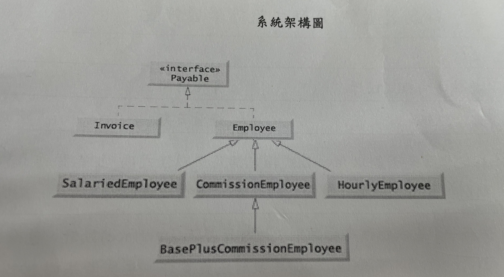

 

### 任務一：設計一個類別「HourlyEmployee」，繼承 Employee，實作 Payable界面，用以表示時薪員工，並具備基礎錯誤參數檢查的建構式與服務方法功能：
- 需要實作「getPaymentAmount」方法，代表取得應付金額的功能
- 需要實作「wage」 、「hours」屬性以及屬性的取得、設定服務方法
- 需要實作「HourlyEmployee」方法，代表類別建構式
- 請覆寫「toString」方法，提供顯示時薪員エ各項明細資料的功能
- 各種屬性實體變數於操作屬性寫入時需實作數値合理範圍的檢査功能

### 任務二：設計一個類別階層，分別為「Commission Employee 」、BasePlusCommissionEmployee」2個類別，繼承 Employee，實作 Payable 界面，用以表示佣金員工及底薪加佣金員工，並具備基礎錯誤參數檢查的建構式與服務方法功能：
 - 需要分別為 「Commission Employee」、「BasePlusCommissionEmployee」實作「getPaymentAmount」方法，代表取得應付
金額的功能
- 需要分別實作 「grossSales」、「commissionRate」、「baseSalary」屬性
以及屬性的取得、設定服務方法
- 需要分別實作 「CommissionEmployee」、「BasePlusCommissionEmployee」方法，代表類別建構式
- 請分别覆寫「toString」方法，提供顯示薪水的功能
- 各種屬性窴體孌數於操作屬性寫入時需實作數值合理範圍的檢查功能

### 任務三：設計一個類別 「InterfacePayableTest」，具備程式進入點Main()功能，利用 Payable界面、多型的處理各種「Employee」、「Invoice」子類別：
- 至少需要內含二個 Invoice 實體物件
- 至少需要內含一個 HourlyEmployee 實體物件 
- 至少需要內含一個 SalariedEmployee 實體物件
- 至少需要內含一個 Comrission Employee、一個 BasePlusCommissionEmployee 實體物件，並將 CommissionEmployee之獎金比率提高 50%
- 請利用 toString、getPaymentAmount 方法，進行 Payable 界面多型呼叫，
以輸出所有應付帳款明細項目